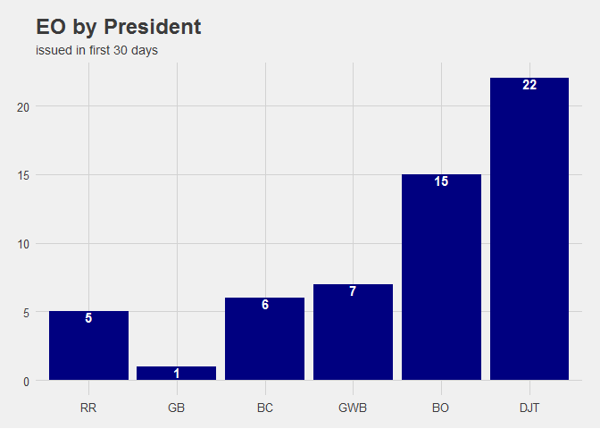

# Executive Order Analysis

#Data and Packages

##Data

data from :[The American Presidency Project](http://www.presidency.ucsb.edu/executive_orders.php?year=2017&Submit=DISPLAY) 
##Packages

```r
library(tidyverse)
library(stringr)
library(forcats)
library(countrycode)
library(maps)
library(tidytext)
library(ggthemes)
library(ggrepel)
library(wordcloud)
library(lubridate)
data(world.cities)
library(readr)
EXEC_ORD2 <- read_csv("~/R/ExecOrders/EXEC_ORD2.csv")
set.seed(1)
```

Need to prep the data to include president initials `pres` and days in office when EO ws signed `DIO`. I also want to make the president set as factors in order of when they took office. Thankfully the data is already in order by date, so I can rely on `fct_inorder` to take care of the ordering for me. I also need to fix the dates.

##Prepping Data

```r
EXEC_ORD2$President <-fct_inorder(factor(EXEC_ORD2$President,ordered=TRUE))
levels(EXEC_ORD2$President)
```

```
## [1] "Ronald Reagan"      "George Bush"        "William J. Clinton"
## [4] "George W. Bush"     "Barack Obama"       "Donald J. Trump"
```

```r
EXEC_ORD2<-EXEC_ORD2 %>% mutate(pres= ifelse(President=="Ronald Reagan","RR",
                                      ifelse(President=="George Bush","GB",
                                      ifelse(President=="William J. Clinton","BC",
                                      ifelse(President=="George W. Bush","GWB",
                                      ifelse(President=="Barack Obama","BO",
                                      ifelse(President=="Donald J. Trump","DJT","NA")))))))

EXEC_ORD2$Date<- dmy(EXEC_ORD2$Date)
EXEC_ORD2$pres<- fct_inorder(factor(EXEC_ORD2$pres,ordered=TRUE))

EXEC_ORD2<-EXEC_ORD2 %>% mutate(DIO= as.numeric(ifelse(pres=="RR",round(difftime(Date,'1981-01-20',units="days"),0),
                                     ifelse(pres=="GB",round(difftime(Date,'1989-01-20',units="days"),0),
                                     ifelse(pres=="BC",round(difftime(Date,'1993-01-20',units="days"),0),
                                     ifelse(pres=="DJT",round(difftime(Date,'2017-01-20',units="days"),0),
                                     ifelse(pres=="BO",round(difftime(Date,'2009-01-20',units="days"),0),
                                     ifelse(pres=="GWB",round(difftime(Date,'2001-01-20',units="days"),0),"NA"))))))))
```

#EDA

##Diving into the text
Using `tidytext` I can explore than nuts and bolts of the executive order descriptions


```r
eo2_words<-EXEC_ORD2 %>% select(1,3,4,5) %>% unnest_tokens(word,Description) %>% count(President,word,sort=TRUE) %>% ungroup()%>% filter(!word %in% c("of","the","and","to","in","no","on","for","with","an","executive","order","a","as","by"))
total_words<-EXEC_ORD2 %>% select(1,3,4,5) %>% unnest_tokens(word,Description) %>% count(President,word,sort=TRUE) %>% ungroup()%>%group_by(President) %>% summarize(total=sum(n))
total_words2<-eo2_words %>% group_by(President) %>% summarize(total=sum(n))
eo2_words<-left_join(eo2_words,total_words2)
```

```
## Joining, by = "President"
```

```r
eo2_words<-eo2_words %>% bind_tf_idf(word,President,n)
```

If I leave Donald Trump in the data, his tf-idf scores would dominate, due to the low amount of total words thus far, so I'm removing him.


```r
plot_words <- eo2_words %>%
  arrange(desc(tf_idf)) %>%
  mutate(word = factor(word, levels = rev(unique(word)))) %>% filter(President!= "Donald J. Trump")
```

Then plotting:


```r
ggplot(plot_words[1:30,], aes(word, tf_idf, fill = President)) +
  geom_bar(stat = "identity") +
  labs(x = NULL, y = "tf-idf") +
  coord_flip()
```

<!-- -->


Now breaking out by President:


```r
plot_words<- plot_words %>% 
  group_by(President) %>% 
  top_n(15) %>% 
  ungroup
```

```
## Selecting by tf_idf
```

```r
ggplot(plot_words, aes(word, tf_idf, fill = President)) +
  geom_bar(stat = "identity", show.legend = FALSE) +
  labs(x = NULL, y = "tf-idf") +
  facet_wrap(~President, ncol = 2, scales = "free") +
  coord_flip()
```

<!-- -->

##International Affairs
I'm interested in how often presidents specifically name countries in their exectuive order titles. Obviously the text of the EOs would be better for identifying actions aimed at specific countries, but since I don't have that data yet, this will serve as a good proxy. I notice that Cote d'Ivoire won't get identified since my reference data lists it as Ivory Coast, so I specifically look for that. I'm probably missing other instances but haven't looked through each line of the data to see what else I need to account for due to having 1503 rows. I had to remove 'Jersey' from being identified, since all instancesI noted were in reference to New Jersey, the state.

```r
countries_words2<- eo2_words %>% filter(word %in% tolower(countrycode_data$country.name) |word %in% tolower(world.cities$country.etc) | word %in% c("d'ivoire") ) %>% filter(word != "jersey")
```


```r
totcountries<- countries_words2 %>% group_by(word) %>% summarise(n=sum(n))
wordcloud(totcountries$word,totcountries$n, min.freq=0)
```

<!-- -->


```r
countries_words2 %>% arrange(desc(n)) %>% ggplot(aes(x=1,n))+
  geom_text_repel(aes(label=word, col=President),size=5,  force =10, segment.colour = "transparent")+ 
  scale_x_continuous(breaks = NULL) +labs(x='')+
  theme_fivethirtyeight()
```

<!-- -->

Tough to really make much out of that, though it gives a more accurate idea of quantity. Trying a President colored wordcloud gives us an idea of proportion or comparative occurence.


```r
countries_words2 %>% 
  ggplot +
  aes(x = 1, y = 1, size =n, label = word,col=President) +
  geom_text_repel(segment.size =FALSE, force =1, segment.colour = "transparent") +
  scale_size(range = c(2, 15), guide = FALSE) +
  scale_y_continuous(breaks = NULL) +
  scale_x_continuous(breaks = NULL) +
  labs(x = '', y = '') +
  theme_fivethirtyeight()
```

<!-- -->


```r
countries_words2 %>% 
  ggplot +
  aes(x = 1, y = 1, size =n, label = word,col=President) +
  geom_text_repel(segment.size =FALSE, force =1, segment.colour = "transparent") +
  scale_size(range = c(2, 15), guide = FALSE) +
  scale_y_continuous(breaks = NULL) +
  scale_x_continuous(breaks = NULL) +
  labs(x = '', y = '') +
  theme_fivethirtyeight()+facet_wrap(~President,ncol=2,scales="free")
```

<!-- -->

##Pacing
Now I'm curious about how each president stacks up based on activity upon entering office. It seems Donald Trump has been extremely active since taking office, but what does the data say? I'll start by looking at first 30 days, then first 90 days to get a decent guage. I would expect Obama to have been equally or more active due to the financial crisis when he took office.


```r
EXEC_ORD2%>% filter(DIO<=30) %>% group_by(pres)  %>% mutate(maxdio= max(DIO)) %>% 
  ggplot(aes(pres))+geom_bar(fill="navyblue")+theme_fivethirtyeight()+
  ggtitle("EO by President", subtitle="issued in first 30 days")+
  geom_text(stat="count",aes(y=..count..,label=..count..), vjust=1,fontface="bold",col="white")
```

<!-- -->

Wow, Donald Trump is outpacing his peers significantly. Maybe other presidents were a little slower on the draw, and waited for their cabinet to get in place. How does he hold up within the first 90 days?


```r
EXEC_ORD2%>% filter(DIO<=90) %>% group_by(pres)  %>% mutate(maxdio= max(DIO)) %>% 
  ggplot(aes(pres))+geom_bar(fill="navyblue")+theme_fivethirtyeight()+
  ggtitle("EO by President", subtitle="issued in first 90 days")+
  geom_text(stat="count",aes(y=..count..,label=..count..), vjust=1,fontface="bold",col="white")
```

<!-- -->

That is certainly surprising. Donald Trump has issued more executive orders in his first 20 days than any of the previous 5 did in their first 90 days.

##Wordiness

Is wordiness of Executive orders consistent, or does one president have a tendency to use more words per order than others?


```r
total_words<-EXEC_ORD2 %>% select(1,3,4,5) %>% unnest_tokens(word,Description) %>% count(President,word,sort=TRUE) %>% ungroup()%>%group_by(President) %>% summarize(total=sum(n))

total_words %>% ggplot(aes(x=President,y=total))+geom_bar(stat="identity",fill="navyblue")+theme_fivethirtyeight()+
  ggtitle("Total Words by President")+
  geom_text(stat="identity",aes(y=total,label=total), vjust=1,fontface="bold",col="white")
```

<!-- -->

```r
count<-EXEC_ORD2 %>% group_by(President) %>% count()
joined<-total_words %>% left_join(count,by= "President") %>% mutate(rate= round(total/n,1))

joined%>% ggplot(aes(x=President,y=rate))+geom_bar(stat="identity",fill="navyblue")+theme_fivethirtyeight()+
  ggtitle("Wordiness by President", subtitle="words per EO")+
  geom_text(stat="identity",aes(y=rate,label=rate), vjust=1,fontface="bold",col="white")
```

<!-- -->

I guess the W stands for 'wordsmith'! Would not have guessed that George W. Bush would be the wordiest.
